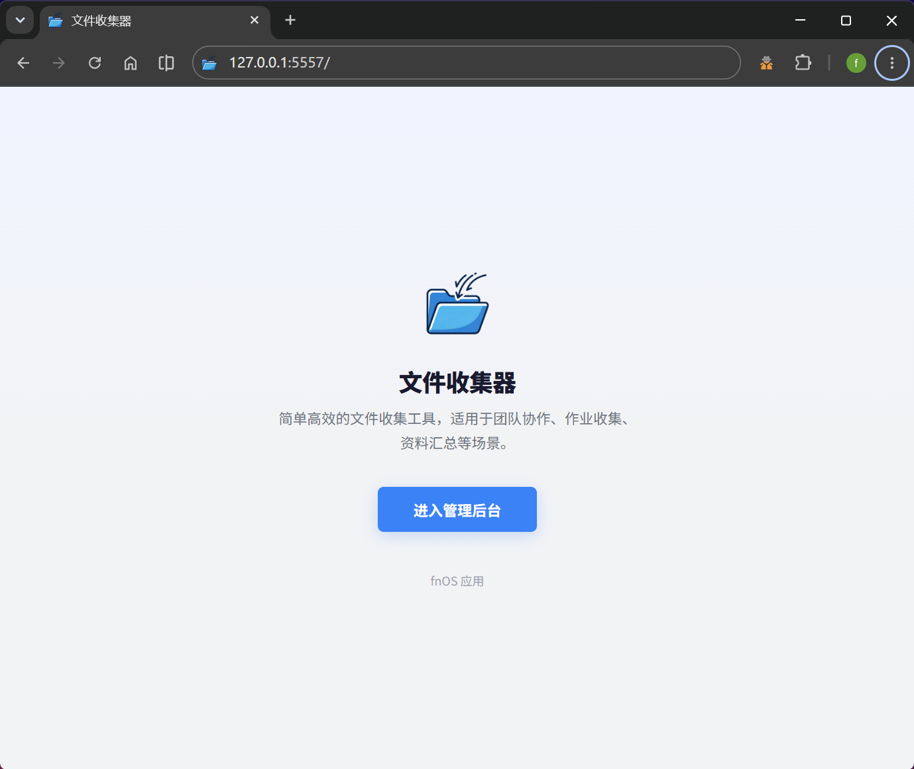
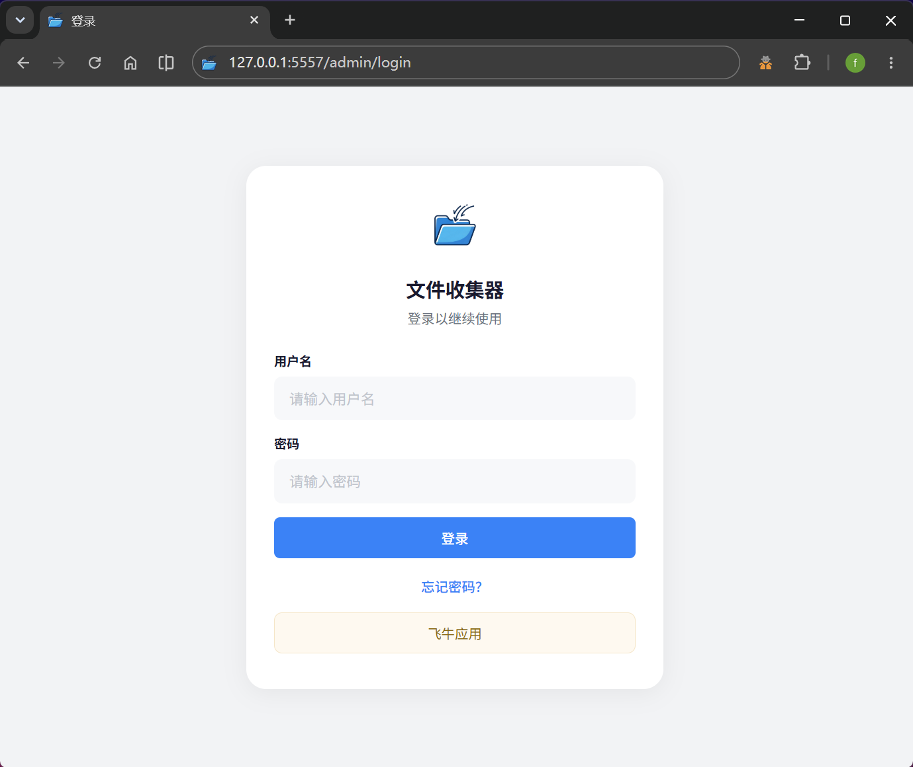
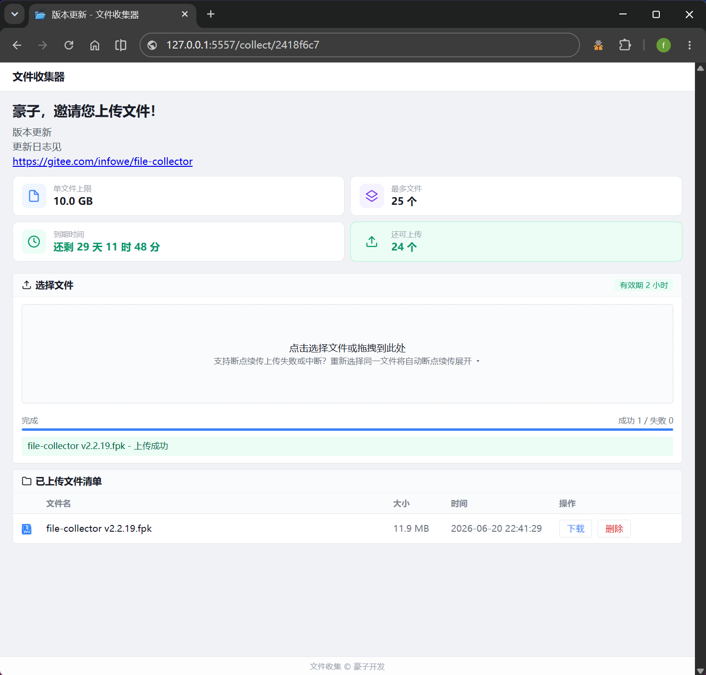
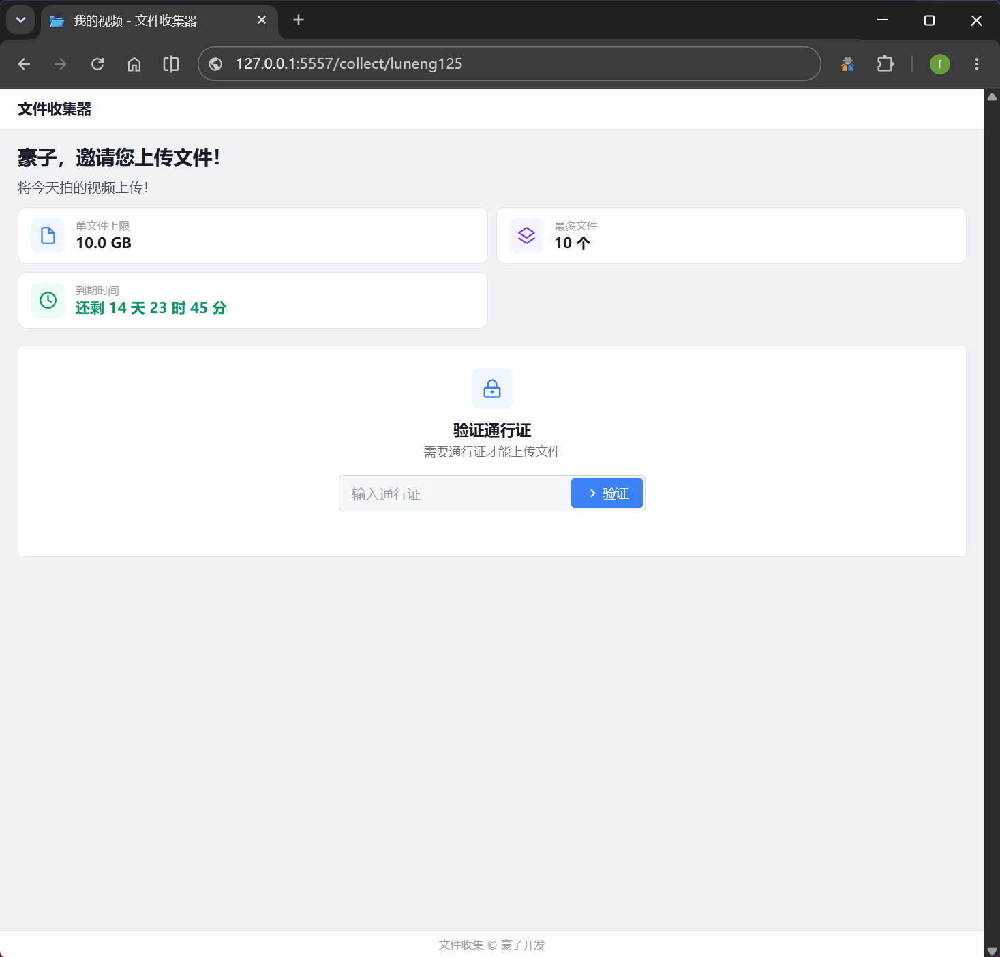
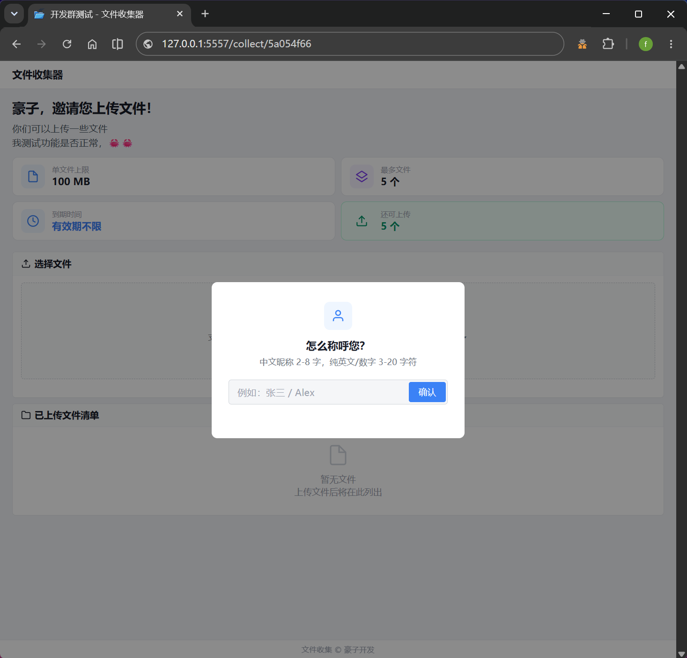
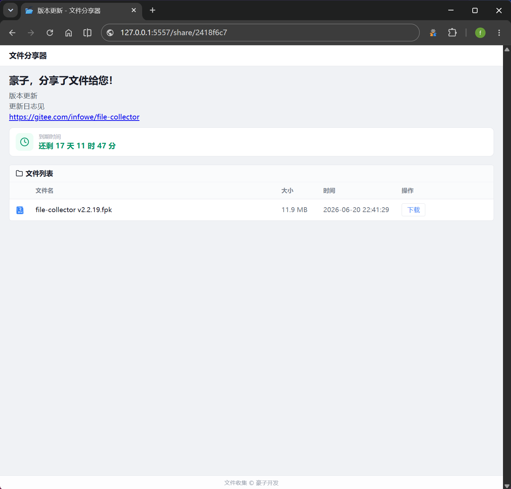

# 文件收集器 (File Collector) 

<p align="center">
  
</p>

<p align="center">
  <strong>基于 Flask + SQLite 的多用户文件收集与分享系统 | 支持 Office 在线预览 | 专为飞牛 fnOS 打造</strong>
</p>

<p align="center">
  
  
  
  
  
</p>

---

## 📖 简介

文件收集器是一个功能完备的轻量级 Web 应用，支持**多用户体系**、**Office 在线预览**和**双模式分享**。管理员可在后台创建多个独立的收集链接，每个链接自动生成**收集页**（上传）和**分享页**（浏览下载）两种模式——两者拥有**各自独立的通行证**（可分别设为密码保护或公开访问），以及独立的上传限制、有效期和自定义短链接。支持上传者身份识别、按上传者分文件夹存储，0.01-64 GB 大文件断点续传（TUS 协议）。内置邀请码注册系统，支持管理员和普通用户两种角色。Office 文件（Word/Excel/PPT）可直接在线预览，无需下载。非常适合团队协作、作业收集、资料汇总、文件分发等场景。

**适用平台：** [飞牛 fnOS](https://www.fnnas.com/) **独占** Native 应用（.fpk 格式），不支持 Docker 部署（已停止更新）。支持 **x86 / ARM** 平台。

---

### 🚀 快速导航

| | | |
|------|------|------|
| [✨ 功能特性](#✨-功能特性) | [🖼️ 界面预览](#🖼️-界面预览) | [⚡ 快速开始](#⚡-快速开始) |
| [🏗️ 技术架构](#🏗️-技术架构) | [📂 收集与分享](#📂-收集与分享) | [💡 使用场景](#💡-使用场景) |
| [🌍 环境变量](#🌍-环境变量) | [🔌 API 文档](#🔌-api-文档) | [❓ 常见问题](#❓-常见问题) |
| [📋 更新日志](#📋-更新日志) | | |

> 提示：点击上方链接可直接跳转到对应章节。

---

## ✨ 功能特性

### 🎯 核心功能

| 功能 | 说明 |
|------|------|
| 👥 **多用户系统** | 支持管理员与普通用户角色，邀请码注册，用户启用/停用/编辑/重置密码 |
| 📄 **Office 预览** | Word/Excel/PPT 在线预览（JIT Viewer SDK），无需下载即可查看 |
| 🔗 **多链接管理** | 创建/编辑/启用/禁用/删除，支持**自定义短链接 ID**（3-32 位字母数字） |
| 🔑 **双通行证** | 收集页和分享页各自独立的通行证，分别可设为密码保护或空通行证（公开访问） |
| 🔓 **公开收集** | 勾选「空通行证」即可开放公开访问，无密码也可上传/下载 |
| 📤 **文件收集** | 多文件拖拽 + 点击上传，进度条实时显示，支持 TUS 断点续传大文件 |
| 📥 **文件分享** | 同一链接生成分享页（只读模式），可浏览和下载文件，按上传者分组展示 |
| 👤 **上传者身份** | 要求上传者填写昵称，按上传者分文件夹存储，每人独立上传配额 |
| 🎬 **多媒体预览** | 图片/PDF/视频/文本文件在线预览 |
| 📏 **文件限制** | 自定义单文件大小上限（0.01-64 GB）和上传数量上限（0=不限制） |
| ⏱️ **有效期控制** | 收集页和分享页各自的独立有效期，到期自动失效 |
| 📋 **上传历史** | 收集者和管理员均可查看/下载/预览已提交文件 |
| 🗑️ **文件管理** | 上传者可删除自己的记录，管理员支持批量删除 |
| 🎫 **邀请码系统** | 管理员生成邀请码（可设有效期），用户凭码注册 |
| 📦 **数据备份** | 一键下载/导入 SQLite 数据库，自动验证和备份旧库 |
| 🔒 **安全防护** | CSRF 保护、登录频率限制、通行证验证速率限制、会话安全、危险文件拦截 |
| 📱 **响应式 UI** | 桌面和移动端完美适配，微信浏览器自动提示跳转 |
| 🎨 **深度定制** | 自定义站点标题、登录提示、页尾文字、首页开关、公网网址 |

### ⚙️ 管理员后台

- **📊 仪表盘** — 总览统计（链接数/记录数/存储用量/活跃链接）+ 最近上传
- **🔗 收集链接** — 创建、编辑、启停、删除、一键复制收集/分享链接、自定义短链接 ID（支持中文拼音）、独立通行证设置
- **📋 上传记录** — 分页浏览、按链接过滤、批量删除、在线预览、下载文件
- **👥 用户管理** — 查看用户列表、编辑用户名/密码、启用/停用/删除/重置密码
- **🎫 邀请码管理** — 生成邀请码（支持设置有效期）、查看使用状态
- **⚙️ 系统设置** — 账号密码修改、默认上传参数、通行证有效期、公网网址、注册开关、禁止文件类型、数据库备份恢复
- **🐛 反馈卡片** — GitHub Issues 一键反馈，前端直连检测，网络不可达时友好提示
- **ℹ️ 系统信息** — 实时显示数据库路径、上传目录、监听端口、版本更新检测

---

## 🖼️ 界面预览

<table>
  <tr>
    <td align="center"><b>首页</b></td>
    <td align="center"><b>登录</b></td>
  </tr>
  <tr>
    <td></td>
    <td></td>
  </tr>
  <tr>
    <td align="center"><b>收集页</b></td>
    <td align="center"><b>带通行证-收集页</b></td>
  </tr>
  <tr>
    <td></td>
    <td></td>
  </tr>
  <tr>
    <td align="center"><b>带上传者-收集页</b></td>
    <td align="center"><b>分享页</b></td>
  </tr>
  <tr>
    <td></td>
    <td></td>
  </tr>
</table>

---

## ⚡ 快速开始

### 📦 fnOS 应用商店安装

1. 下载 `.fpk` 安装包
2. 在 fnOS 应用管理中点「手动安装」，选择 `.fpk` 文件
3. 安装向导中设置管理员账号及**监听端口**（默认 5557）
4. 安装完成后访问 `http://[NAS_IP]:端口/admin`

> 💡 **端口可自定义**，安装时自由选择。如需外网访问，建议配合 Nginx/Caddy 反代使用。

> 🔄 **升级说明**：在应用商店中点击升级即可，数据自动保留。升级向导会自动预填当前端口号。

### 🚪 首次使用

1. 访问管理后台 `/admin`，使用默认账号登录
2. 前往「收集设置」→ 修改管理员密码和昵称
3. 前往「收集链接」→ 创建第一个收集链接
4. 复制收集链接或分享链接，发送给目标用户

### 🔐 默认账户

| 用户名 | 密码 |
|--------|------|
| `admin` | `admin123` |

> ⚠️ 首次登录后请立即修改密码！

---

## 🏗️ 技术架构

```
file-collector/
├── app/
│   ├── server/
│   │   ├── app.py              # Flask 主应用（路由、数据库、业务逻辑）
│   │   ├── templates/           # Jinja2 模板（10 个页面）
│   │   └── static/              # CSS、图片、图标
│   └── ui/                      # 桌面图标资源
├── cmd/
│   ├── main                     # 生命周期管理（start/stop/status/uninstall）
│   ├── install_init             # 安装前初始化
│   └── uninstall_callback       # 卸载后清理
├── config/
│   ├── privilege                # 运行权限配置
│   └── resource                 # 共享目录声明
├── wizard/
│   └── install                  # 安装向导配置
├── manifest                     # 应用元信息
├── logo.png                     # Logo
└── README.md
```

| 组件 | 技术 | 说明 |
|------|------|------|
| Web 框架 | Flask 3.0.0 | 路由、模板渲染、会话管理 |
| 数据库 | SQLite（WAL 模式 + 外键约束） | 零配置、高性能并发读写 |
| 密码哈希 | Werkzeug Security | bcrypt 级别安全存储 |
| 断点续传 | TUS 协议 | 5MB 分片 + 3 并发 + 自动恢复 |
| Office 预览 | JIT Viewer SDK | Word/Excel/PPT 在线实时渲染 |
| 生产部署 | Gunicorn | 多 worker 进程，Nginx 反代 |
| Python | 3.11+ | 飞牛 fnOS 系统原生内置 |
| 离线安装 | Wheel 预编译包 | x86 + ARM 双架构，零网络依赖 |

---

## 📂 收集与分享（双模式）

每个链接自动生成两个独立页面，两者拥有**各自的配置**：

| 属性 | 收集页 | 分享页 |
|------|--------|--------|
| **地址** | `/collect/<id>` 或自定义 slug | `/share/<id>` 或自定义 slug |
| **用途** | 文件上传 | 文件浏览与下载 |
| **独立开关** | `collect_disabled` 复选框 | `share_enabled` 开关（默认关闭） |
| **通行证** | 单独设置密码或空通行证 | 可设独立密码、空通行证，或**回退复用**收集页密码 |
| **有效期** | 独立到期时间 | 独立到期时间 |
| **自定义 ID** | 3-32 位自定义 slug | 3-32 位自定义 slug |
| **描述** | 独立描述文本 | 独立描述文本 |

### 🔑 通行证体系

```
分享页独立通行证  →  已设置则使用
       ↓ 未设置
分享页空通行证    →  已勾选则无需密码
       ↓ 未勾选
复用收集页通行证  →  fallback 到收集页密码
       ↓ 未设置
收集页空通行证    →  已勾选则公开访问（无需密码）
```

- **空通行证（公开收集）**：勾选后链接完全公开，访问者无需输入任何密码即可上传或下载
- **密码通行证**：输入密码验证后，在可配置的有效期内免重复输入
- **通行证缓存**：收集页和分享页的验证状态各自独立（不同 session key），互不干扰
- **安全令牌**：公开链接（无通行证）的下载/预览自动附带 HMAC-SHA256 签名令牌，15 分钟有效期，防止盗链直连

### 🔗 自定义链接 ID

除了系统自动生成的 8 位 UUID 短 ID，创建链接时可自定义更具辨识度的短链接：

- **规则**：3-32 位，字母数字 + `-` `_`，以字母或数字开头
- **示例**：`/collect/team-photo`、`/share/monthly-report`
- 收集页和分享页可分别设置不同的自定义 slug
- 系统保留字（`admin`、`api`、`login` 等）不可使用

### 👤 上传者身份

开启「上传者」功能后：

- 访问者需先填写昵称（中文 2-8 字 / 英文数字 3-20 字符）才能上传
- 文件按上传者分文件夹存储：`<链接文件夹>/<上传者昵称>/`
- 每个上传者享有**独立的上传数量配额**（不与其他上传者共享限额）
- 分享页会将所有文件按上传者分组为折叠面板，一目了然

### 📤 大文件断点续传

- 超大文件自动启用 **TUS 协议分片上传**（5MB 分片，3 并发）
- 支持断点续传：网络中断后自动恢复，无需重新上传
- 单文件上限 0.01-64 GB，硬限制 64GB（Flask `MAX_CONTENT_LENGTH`）
- 上传进度条平滑动画，速度 EMA 平滑显示

---

## 🌍 环境变量

| 变量 | 用途 | 默认值 |
|------|------|--------|
| `DATA_DIR` | 数据库存储目录 | `$TRIM_DATA_SHARE_PATHS/data` |
| `UPLOAD_BASE` | 上传文件存储根目录 | `$TRIM_DATA_SHARE_PATHS/uploads` |
| `PORT` | 监听端口 | `5557` |
| `FLASK_DEBUG` | 调试模式 | `0` |

> **数据库持久化：** 使用 `TRIM_DATA_SHARE_PATHS`（飞牛官方应用文件目录），安装时自动分配，更新/重装不会丢失数据。

---

## 💡 使用场景

| 场景 | 配置建议 | 操作流程 |
|------|---------|---------|
| 📚 **作业收集** | 开启上传者身份，每人独立配额 | 老师创建链接 → 发送到班级群 → 学生填写姓名上传 → 分享页按姓名分组查看 |
| 📄 **资料汇总** | 大文件限制可调至 64GB | 创建收集链接 → 团队上传文档/视频 → 管理员集中下载 |
| 🔗 **文件分发** | 开启分享页，设为公开访问 | 上传文件到链接文件夹 → 分享链接给接收方 → 对方浏览下载 |
| 🏢 **客户交接** | 设置独立通行证 + 有效期 | 创建专用链接 → 客户凭密码上传 → 到期自动失效 |
| 📸 **活动照片墙** | 不限文件数，分享页预览开启 | 参与者扫码上传 → 分享页实时浏览 → 支持在线预览 |
| 🔒 **内部文件共享** | 收集页 + 分享页双通行证 | 管理员上传文档 → 内部员工凭密码访问分享页下载 |

---

## 🔌 API 文档

### 💚 健康检查

```bash
GET /api/status
```

响应示例：
```json
{
  "status": "running",
  "db_ok": true,
  "upload_dir_exists": true
}
```

### 📤 收集页

| 方法 | 路径 | 说明 |
|------|------|------|
| `GET` | `/collect/<link_id>` | 收集页面（通行证 + 上传） |
| `POST` | `/collect/<link_id>/verify` | 验证通行证 |
| `POST` | `/collect/<link_id>/logout` | 退出通行证 |
| `POST` | `/collect/<link_id>/upload` | 上传文件（multipart） |
| `GET` | `/collect/<link_id>/records` | 获取上传历史（JSON） |
| `GET` | `/collect/<link_id>/download/<record_id>` | 下载已上传文件 |
| `GET` | `/collect/<link_id>/preview/<record_id>` | 在线预览文件（图片/PDF/视频/Office） |
| `GET` | `/collect/<link_id>/preview_file/<record_id>` | 获取文件原始内容（JIT SDK 调用） |
| `POST` | `/collect/<link_id>/delete_record/<record_id>` | 删除单条记录 |

### 📥 分享页

| 方法 | 路径 | 说明 |
|------|------|------|
| `GET` | `/share/<link_id>` | 分享页面（通行证 + 文件列表） |
| `POST` | `/share/<link_id>/verify` | 验证通行证 |
| `POST` | `/share/<link_id>/logout` | 退出通行证 |
| `GET` | `/share/<link_id>/records` | 获取文件列表（JSON） |
| `GET` | `/share/<link_id>/download/<record_id>` | 下载文件 |
| `GET` | `/share/<link_id>/preview/<record_id>` | 在线预览文件（图片/PDF/视频/Office） |
| `GET` | `/share/<link_id>/preview_file/<record_id>` | 获取文件原始内容（JIT SDK 调用） |
| `POST` | `/share/<link_id>/delete_record/<record_id>` | 删除单条记录 |

---

## 📋 更新日志

### v2.2.25
- 🎯 share 页新增 **一键下载所有** 按钮：全局选择栏右侧，点击打包全部文件为 zip 下载
- 🖼️ 新增 13 个文件类型 **SVG 彩色图标**：archive/audio/code/config/excel/file/image/pdf/ppt/txt/video/word
- 📄 新增 **txt_reader 纯文本在线预览**阅读器，支持行号显示
- 🎨 collect/share 页 `cp-meta-grid` **彩色卡片视觉优化**：每种卡片带彩色图标左边框

### v2.2.24
- 🎫 设置页新增 **GitHub Issues 反馈卡片**：前端检测连通性，网络不可达时友好提示
- 🔧 CSP `connect-src` 白名单增加 `github.com`
- 📱 `admin_links` 移动端 header 改为横向排版，更紧凑
- 📝 创建/编辑链接页描述 placeholder 优化：
  - 收集描述：`例：请上传项目A资料，和相关说明文档。`
  - 分享页描述：`留空则使用上方收集描述。例：这是项目A资料，请下载。`
  - 描述表单下方新增「轻量化运行，支持HTML标签」提示文字
- 📋 复制链接文案全面升级：
  - 复制文本引入**管理员昵称/账号动态显示**（优先昵称，回退账号，兜底"用户"）
  - 格式优化：描述语前置 → 密码 → 链接后置，微信分享阅读体验更自然
  - 收集页：`{昵称}，邀请您通过此链接上传文件`
  - 分享页：`{昵称}，通过此链接给您分享了文件`
- 🧹 `admin_links` 脚本重构：Jinja2 模板变量全部移入 `data-*` 属性，消除 IDE lint 误报（8 个错误归零）
- 🔐 登录时自动加载昵称到 session，修改昵称同步更新 session，确保复制文案始终最新

### v2.2.23
- 登录/注册/忘记密码/重置密码页 UI 全面优化
- 密码框新增显隐切换（小眼睛图标）
- 提交按钮 loading 状态（旋转动画防重复点击）
- 输入框默认边框可见（不再像 disabled）
- 卡片淡入动画，间距统一
- 修复无权限页 btn-secondary 样式缺失 Bug

### v2.2.22
- wizard/upgrade 新增端口字段，升级时自动预填安装端口
- 安装向导 / 升级向导文案丰富优化
- favicon 优化至 5KB，移除 up.png 残留引用
- 数据库管理卡片间距优化

### v2.2.21
- **适配飞牛系统自带 Python 3.11**：移除 `install_dep_apps = python312` 依赖，直接使用系统 `python3`
- **离线 wheel 全面 cp311 编译**：`markupsafe`/`pillow`/`pillow-heif` 全部换为 cp311 manylinux，保持零网络依赖安装
- `cmd/main` 简化 Python 查找逻辑，不再硬编码 python312 路径
- 更新 README Python 版本标识为 3.11+

### v2.2.20
- **离线 wheel 打包**：内置 x86_64 + aarch64 双架构预编译 wheel，安装零网络依赖，2 秒完成（原在线安装需 5+ 分钟）
- **三层安装保障**：离线 wheel 优先 → 清华镜像回退 → 跳过非关键依赖，确保任何环境都能安装
- `cmd/main` 补全 `tinycss2` 和 `pillow-heif` 安装（之前漏装），`pillow-heif` 强制用 wheel 避免源码编译
- 提取 `card-compact`/`form-input-sm`/`toggle-switch`/`btn-more`/`modal` 等公共组件到全局 `style.css`，消除多页面样式碎片化
- `collect`/`share` 页提取批量选择 CSS 到 `_batch.css`，用 `--batch-accent` 变量区分主色
- `tus.min.js` 改 `defer` 非阻塞加载，提升首屏速度
- `collect`/`share` 页预览图片/视频保留 loading spinner，加载完成再替换内容
- 文件列表新增骨架屏，改善加载感知速度
- 平台支持调整为 **x86 / ARM**（去除 LoongArch / RISC-V）

### v2.2.19
- 全新应用图标，替换全部 ICON 和 favicon
- 上传进度条 rAF 平滑插值引擎，60fps 丝滑动画，告别台阶式跳变
- 上传速度 EMA 平滑处理，数字不再剧烈跳动
- 隐藏收集页/分享页/管理后台顶部 logo 图标，界面更精简
- 修复 favicon.ico 空白无法显示的问题

### v2.2.18
- 修复 TUS 断点续传上传因 `make_response` 未导入导致所有大文件上传返回 500 的严重错误
- 禁止上传同名文件，冲突时提示「已存在，请改名后上传」，不再静默自动改名
  - TUS 上传在创建会话时即预检文件名冲突，避免传完大文件才发现
  - 前端选择文件时预检禁止的扩展名，实时提示「文件类型被禁止上传」
- 优化上传错误反馈
  - TUS 永久错误（409/400/403 等）立即提示，不再被 retryDelays 反复重试导致 59 秒延迟
  - 网络错误显示「网络连接失败，请检查网络后重试」
  - 普通上传异常不再静默吞错，显示具体错误信息
- 修复反向代理场景兼容性
  - TUS Location 头和前端 endpoint 改用 `url_for` 生成，支持带路径前缀的反代
  - 修复 `Upload-Expires` 时区偏差（本地时间误标 GMT），改用 UTC
- 上传日志页事件类型补全中文显示（创建会话、断点续传完成）

### v2.2.17
- 修复 Nginx 反代环境下大文件合并超时导致"上传会话不存在"的错误
  - 合并端点同时接受 `uploading` 和 `merging` 状态，Nginx 超时重连后自动等待合并完成
  - 前端合并重试从 2 次增至 10 次，递增等待最长 30 秒
  - 对"正在合并中"和"上传会话不存在"错误自动重试，无需手动干预

### v2.2.16
- 修复分片上传合并时偶发缺失分片的问题（并发上传队列提前 resolve 竞态条件）
- 分片上传到 100% 后显示"正在合并分片"提示，不再卡住无反馈
- 修复上传日志和下载日志时间显示为 UTC 时间的问题（慢 8 小时）
- 分片上传频率限制改为并发会话数限制，不再误杀正常大文件上传

### v2.2.15
- 修复 Nginx 反代和 Unix Socket 反代场景下获取不到用户真实 IP 的问题
- ProxyFix x_for 从 2 改为 1，匹配单层反代场景
- remote_addr 为本地回环时回退到 X-Real-IP / X-Forwarded-For
- 移动端登录页去除卡片边框，全屏白色背景

### v2.2.14
- 修复管理后台删除确认弹窗 XSS（链接标题含 HTML 标签时可注入）
- 修复收集页预览按钮在文件名含特殊字符时的 onclick 截断问题
- 修复文件预览页下载链接未转义，URL 含双引号可破坏 HTML 结构
- 修复管理后台 stripHtml 使用 innerHTML 解析的安全隐患
- 默认密码 admin123 登录后强制跳转设置页修改，不再仅提醒
- 频率限制改为 SQLite 存储，多 worker 部署下计数共享
- 分片上传断点续传增加 IP 校验，防止不同用户传同名文件时串会话
- 分片上传接口增加频率限制（120次/分钟），防止刷分片占满磁盘
- SESSION_COOKIE_SECURE 改为环境变量控制，HTTPS 部署时设 SESSION_COOKIE_SECURE=1 启用
- 获取客户端 IP 优先使用 ProxyFix 修正后的 remote_addr，不再直接取 X-Forwarded-For 首个值
- 数据库还原接口补全显式 CSRF 校验
- 收集页和分享页新增到期时间实时倒计时

### v2.2.13
- 数据库与日志完整迁入共享目录：DATA_DIR 从 `${TRIM_PKGVAR}/data` 改为 `${TRIM_DATA_SHARE_PATHS}/data`
- 所有生命周期日志（安装/升级/卸载/Gunicorn）统一放入共享 DATA_DIR，卸载/重装不丢失
- cmd/main 启动时自动迁移旧数据（从 TRIM_PKGVAR → SHARE/data），无需手动操作
- 6 个脚本统一 DATA_DIR 解析逻辑，调试日志仍保留在 /tmp（临时性质）
- 安装向导新增自定义监听端口（默认 5557），管理员账号与端口合并为同一页面
- 桌面快捷方式端口动态适配：`app/ui/config` 通过 `${wizard_app_port}` 变量自动替换
- cmd/main 启动脚本读取 `wizard_app_port` 环境变量，升级用户自动 fallback 5557
- 公开链接安全增强：无通行证链接的下载/预览请求携带 HMAC-SHA256 签名令牌，15 分钟有效期，防止盗链直连

### v2.1.27
- 卸载向导：可选择保留或删除数据库，上传文件始终保留
- 后台新增用户：管理员可直接创建用户（用户名/密码/邮箱/昵称/管理员身份）
- 文件夹自动检测：后台定时扫描链接文件夹，自动识别手动放入的文件并清理孤儿记录

### v2.1.26
- 分享页上传者分组首个文件夹默认展开
- venv 缓存加速，首次安装后自动存档，后续重建秒级恢复
- 分享页预览/下载权限独立控制，不再受收集页开关影响

### v2.1.25
- 上传路径自动同步，修改路径后自动迁移已有文件记录
- 预览下载权限双重门控：前端按钮 + 后端路由同步拦截

### v2.1.24
- 单文件上限 MB 显示精度修复，旧链接数据自动兼容

### v2.1.23
- 分片上传增强：速率限制提升、429 自动重试、缺失分片自动补传
- 上传速度改用 3 秒滑动窗口算法，续传速度显示更准确

### v2.1.22
- 上传者开关与通行证可共存，两者不再互斥
- 设置页滑动按钮开关，数据库管理卡片美化
- 修复上传者退出身份后文件列表不刷新、通行证弹窗重叠等问题

### v2.1.21
- 上传者身份功能：空通行证链接可要求上传者填写昵称
- 按上传者分文件夹存放，同一链接不同上传者文件独立隔离


### v2.1.20
- 修复 cmd/main 缺少 upgrade 处理器导致升级异常退出
- 加强数据库备份机制，/var/backups 三重备份位置

### v2.1.19
- manifest 版本号同步

### v2.1.18
- 修复数据库恢复后 cookie 跨 worker 解密失败的登录问题

### v2.1.17
- 数据库完整性验证改用 sqlite3 真实查询
- /var/backups 安全备份机制：启动/卸载/升级均自动备份

### v2.1.16
- 修复 session 降级导致频繁重新登录的问题
- 卸载时保留数据库，重装后自动恢复

### v2.1.15
- 数据库恢复后自动重建管理员 session，无需重新登录

### v2.1.14
- 修复升级时数据库备份失败导致数据丢失的问题

### v2.1.13
- 数据库恢复优先级统一

### v2.1.12
- 修复最大上传数设为 1 时按钮无法点击的问题

### v2.1.11
- 数据库备份移至应用自身数据目录，避免 /tmp 重启清空

### v2.1.10
- 升级时自动备份恢复数据库

### v2.1.8
- 卸载时不再删除上传文件

### v2.1.7
- 导入老版本数据库时自动兼容字段缺失

### v2.1.5
- 分享页空通行证设置修复

### v2.1.3
- 创建链接时自动创建专属文件夹，文件夹命名基于收集名称

### v2.1.2
- 链接 ID 恢复为 8 位纯 hex 格式，全局昵称优先显示
- 链接卡片头部重设计（渐变背景 + 移动端自适应）
- 分享页独立开关 + 独立通行证
- 大文件 5MB 分片上传，3 并发 + 断点续传
- 上传/下载日志审计
- 设置页瀑布流排版，账号设置新增昵称/邮箱

---

### v2.0.x 主要更新

- 模板预编译 + 静态资源强缓存，TTFB 从 ~11s 降至 ~1s
- JIT Viewer 新窗口全屏预览，预览格式扩展至 20+ 种
- HTML 响应压缩，全局断点统一
- UI 整体优化：按钮圆角统一、通行证验证重新设计、管理后台美化

---

### v1.x 功能演进

**多用户与账号系统**：管理员/普通用户角色、邀请码注册、用户管理（编辑/启停/重置密码）、注册开关、忘记密码、SMTP 邮件通知、欢迎邮件

**收集链接管理**：创建/编辑/启用/禁用/删除、WangEditor 富文本描述、链接有效期（N天后/指定日期/永不过期）、独立通行证保护、空通行证模式

**文件收集与分享**：收集页（上传）+ 分享页（浏览下载）双模式、拖拽上传、批量上传、进度条显示、同名文件冲突提示、禁止上传类型配置、上传者身份记录

**在线预览**：Office（Word/Excel/PPT）JIT Viewer 预览、图片/PDF/视频/文本在线预览

**安全防护**：CSRF 保护、XSS 防护、频率限制、通行证哈希存储、路径遍历防护、CSP 安全响应头、危险文件拦截

**数据管理**：一键备份/导入 SQLite 数据库、上传记录分页/筛选/批量删除、下载计数、孤儿文件自动清理

**部署与界面**：响应式 UI（桌面 + 移动端）、公网网址配置、页尾自定义、首页介绍页（可开关）、支持 x86 / ARM 平台

---

## ❓ 常见问题

<details>
<summary><b>如何让外网用户访问？</b></summary>

1. 在路由器上设置端口转发（将 NAS 端口映射到公网）
2. 或在「系统设置」中配置 Nginx/Caddy 反代
3. 在「收集设置」→「公网网址」中填写公网访问地址
4. 复制链接时会自动使用公网地址
</details>

<details>
<summary><b>上传文件大小限制如何调整？</b></summary>

- 创建/编辑链接时可设置单文件上限（0.01-64 GB）
- 默认值可在「收集设置」中修改
- 硬限制 64GB 受 Flask `MAX_CONTENT_LENGTH` 约束
</details>

<details>
<summary><b>如何让收集页公开（无需密码）？</b></summary>

编辑链接 → 勾选「空通行证」→ 保存。访问者无需输入密码即可上传文件。分享页同样支持空通行证公开访问。
</details>

<details>
<summary><b>升级后数据会丢失吗？</b></summary>

不会。数据库和上传文件存储在共享目录中，升级/卸载/重装均自动保留。系统在关键操作前会自动备份数据库。
</details>

<details>
<summary><b>支持哪些文件类型预览？</b></summary>

- **Office**：Word (.docx)、Excel (.xlsx)、PowerPoint (.pptx) — JIT Viewer 在线渲染
- **图片**：jpg、png、gif、webp、svg、bmp
- **视频**：mp4、webm、ogg
- **文档**：pdf、txt、md、csv
</details>

---

## 👨‍💻 开发者

<table>
  <tr>
    <td align="center">
      <a href="https://github.com/Contribuv">
        <b>豪子</b>
      </a>
    </td>
  </tr>
</table>

---

## 📄 License

MIT License

Copyright © 2025 [豪子](https://github.com/Contribuv/file-collector)
